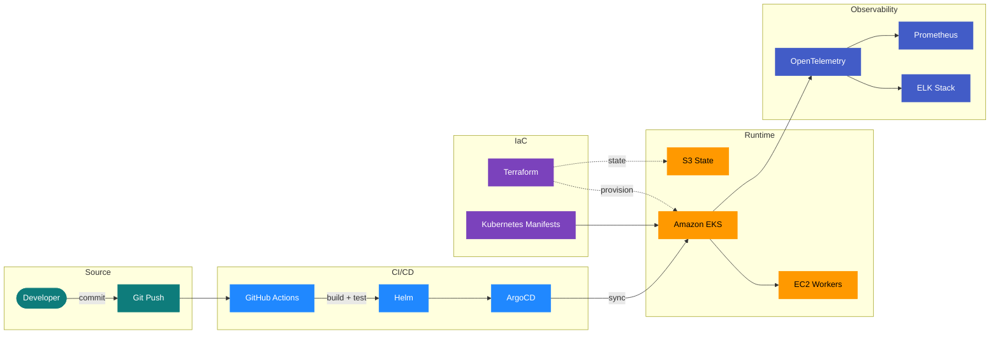

# Hi, I'm Nihar Landge


```yaml
role:      Cloud & DevOps Engineer
focus:     Infrastructure as Code · Observability · CI/CD
location:  India
status:    shipping every sat and sunday
```

---

### Currently

- Building cloud-native platforms with **Terraform**, **Kubernetes**, and **Go**.
- Going deep on **OpenTelemetry**, **ELK**, and **EKS** deployment patterns.
- Contributing to **open-source** observability tooling.
- Open to collaborating on infra, automation, and developer-experience projects.

---

### Tech Arsenal

**Cloud & Infrastructure**


**Observability & CI/CD**


**Languages**


---

### Stack I Run

A snapshot of the cloud-native platform I build and operate. Source-to-prod, fully observable, fully automated.



> _Live in production. Traced end-to-end. Provisioned by code._

---

<p align="center">
  
</p>

<p align="center">
  <sub>Find me elsewhere as <code>@niharlandge</code>.</sub>
</p>

<!--
nihar-landge/nihar-landge
-->
